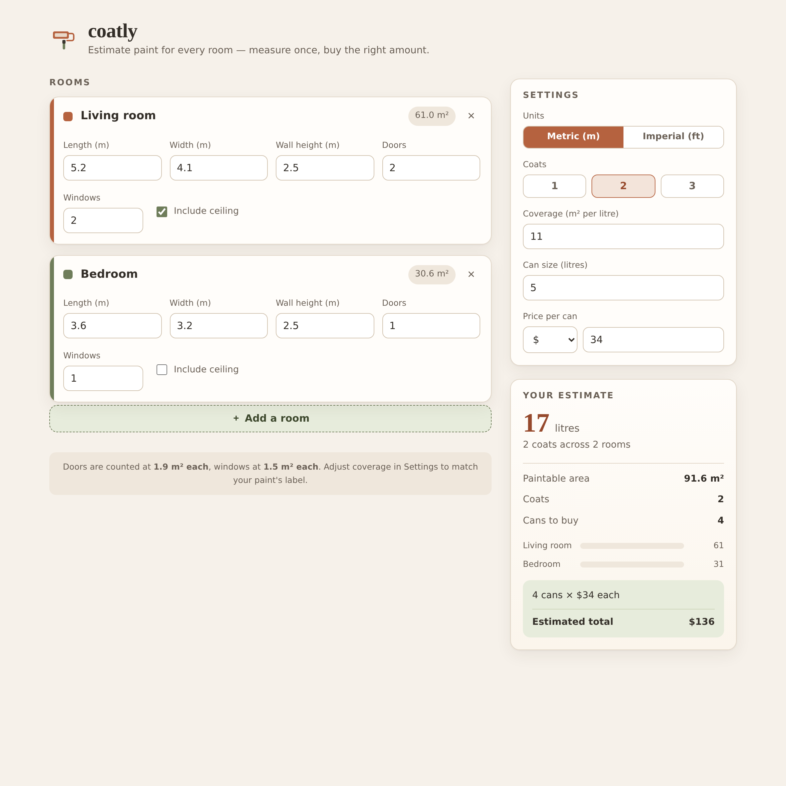

  

<h1 align="center">coatly</h1>

<em>Estimate paint for every room — measure once, buy the right amount.</em>

  

## What it is

**coatly** is a room-by-room paint estimator that runs entirely in your browser. Enter the dimensions of each room, tell it how many coats you're planning, and it works out how much paint you actually need — down to the number of cans to put in your cart and the total you'll spend. No sign-up, no tracking, no internet connection required. Open the file and start measuring.

Most paint "calculators" give you one vague number for one wall. coatly treats a repaint the way a decorator does: as a set of rooms, each with its own walls, ceiling, doors and windows, added up into a single, honest shopping list.

## Who it's for

- **DIY renovators** planning a repaint and tired of guessing at the paint aisle.
- **Painters and decorators** who want to quote a job in under a minute.
- **Landlords and property managers** turning over a unit and budgeting materials.
- **Anyone** who has ever bought two cans too many — or one too few — and had to make a second trip.

## How to use it

1. Open `index.html` in any modern browser.
2. Each room card starts with two example rooms — edit them, or hit **Add a room** for more.
3. For every room, enter length, width and wall height, then the number of doors and windows to subtract. Tick **Include ceiling** if you're painting it too.
4. In **Settings**, choose metric or imperial, set your number of coats, and match the coverage and can size to your paint's label.
5. Read your estimate on the right: total paint, cans to buy, and the estimated cost.

That's it — no install step, no build tools.

## Features

- **True whole-room math** — walls, ceiling, doors and windows are all accounted for, not just a single flat area.
- **Multi-room projects** — plan a whole house at once and see the combined total.
- **Colour-coded rooms** — each room gets its own hue, carried through to a relative-area bar chart so you can see at a glance where the paint is going.
- **Metric and imperial** — switch between metres/litres and feet/gallons; sensible defaults are filled in for you.
- **Coverage you control** — set coverage per litre and can size to match the exact product you're buying.
- **Live cost estimate** — cans needed and total spend update as you type, in your choice of currency.
- **Coats that matter** — one, two or three coats, applied across the whole project.
- **Works offline & private** — a single HTML file. Nothing leaves your device.
- **Print-friendly** — print the page for a clean materials list to take to the shop.

## Assumptions

Doors are subtracted at a standard 1.9 m² each and windows at 1.5 m² each — typical sizes for a quick estimate. Coverage defaults to 11 m² per litre, a common figure for interior matte emulsion; always check your tin, as primers and deep colours cover less. coatly rounds up to whole cans, because you can't buy a third of one.

## Licence

© 2026. All rights reserved. Original artwork and code.
